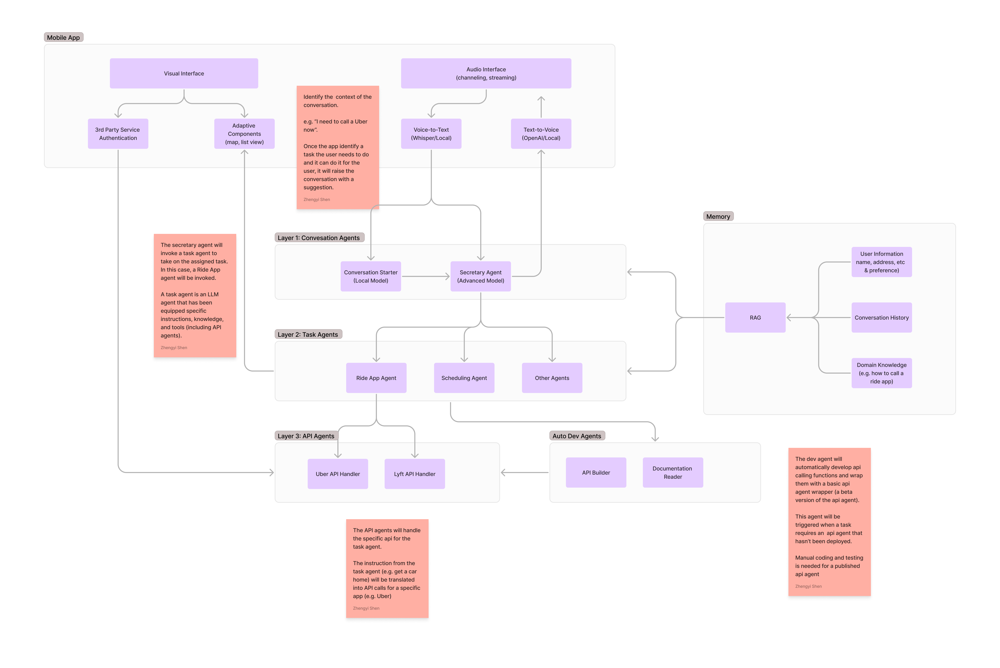

# Keke.ai

Keke is the name of my wife. When I was intially designing the features of my ideal AI companion, her image always came into my mind, and I realized that the ideal experience with AI is just like my life with Keke. This is what my life looks like with Keke:

- When I feel sick, Keke always know what kind of medicine I need to take and will purchase order the medicine I need online (kind like Uber Eat in China) without even asking me and no matter she is by my side or in another city.
- As I frequently forget to have meals, sometimes she would just order food for me as she knows my taste well and what I should eat to stay health.
- We usually travel together, so she is always the one to call a Uber/Didi or purchase tickets for flights or trains for us.
- Keke has a wide connection with experts in different industries, so whenever I want to meet someone, she could always quickly put up a meeting for me with the expert I need to talk to.
- I'm a man who have a very active mind with all kinds of ideas floating around. Even though Keke might not be intererted in or understand what I'm talking about, she is always a good listener. Once a while, she will also ask questions, and usually are good ones, that can stimulate my thinking or point me to a different angle or provide me with some useful resources.

And that is exactly what I wish my AI companion could do.

## Uniqure Value Propositions

### Get-(Little)-Things-Done

Unlike most agentic products on the market that are trying to let AI to complete sophescated problems like coding or researching. Keke focuses on lifting the burden for you on those small but tedious tasks in life that draw your attention to less productive things, and leave YOU, the master of life, to spend more time on the more important, creative, and complex work.

### Do-With-You

Most agentic approaches are trying to let AI to complete one gigantic project all by itself (e.g. Manus.ai). But Keke wants to provdie you with a "do-with-you" experience, which is very similar to the impressive experience when Github Copilot first came out and having the ability to automatically generate codes while the user is typing. Keke would extend that experience from coding to everthing in life. For example, while your are brainstorming or researching on a topic on Keke's Canvas, Keke will automatically generate ideas, search on the web, and use relevant tools for you while you are working on other part of the project.

### Shared Memory

Memory is what makes AI agent distinguish itself from the basic LLMs' chat completion feature. Keke brings the memory feature to the next level by enabling both you (the master) and the agent to share, communicate, and operate on the same base of knowledge. Keke will take notes and try to know more about you everyday. And you can correct or update those information as the memories are not only accessible but also understandable to human.

### Only-for-YOU

Even though memory is a key feature is Keke, we promise to store nothing about you. Everything is stored locally. Only you and Keke have access to it. And every piece of memory is stored in the markdown file that you can migrate to anywhere. No lock-in, No privacy leak. It's all about you and only for you.

### Always-Stand-By

One of the pain points in using a chat-based AI product is "waiting" -- You have to wait between each submission until the llm model generates its last token. But this is not how we operate as a human. It's not uncommon for us to have multiple thonghts in our mind and we want to get all of them done. But with the current model, we only wait for AI to finish one task before we start another one. But that will never be a problem with Keke. With its uniqure architecture design, it's capable of processing multiple tasks at once and can respond to your command whenever is needed.

### ALL-in-One Assistant

One of Keke's super power is it's dynamtic API solution. To put it into plain English, Keke can operate any applications for you such as calling a Uber, ordering on DoorDash, and booking an air ticket. Keke will take care of the job and alert any issues to you so you don't have wait or watch. When you want to use certain services that are out of Keke's current toolbox, Keke will automatically develop a temperary API service for you. If there's any significant issue that it can not handle, it will promote error to us and we will fix it for you. So you can have a unlimited experience with Keke.

### Always-On

Keke is always on your side. You don't have to say "Hey Siri" to start a conversation with Keke. Keke is always actively listening to you. It will offer a helpful hand whenever it can -- it will book a Uber when you are far from you next appointment, it will help you search for restaurants when you are wondering what to eat, it will take notes for you when you have a great idea.

## Technical Design

### User Interface

Obsidian Pugin

- Daily Journal
- Calendar
- Canvas+
  - Obsidian Canvas + Albus's Auto Geneartion + Kosmik's Web View
- Card
  - Google Keep's card-like UI: Pin & Archive; Color-Coding; Side Bar
- Chat Box

### Data Structure & Note Template

From a high-level abstraction, Keke's data structure consist of four key folders: Memory, Task, Knowledge, and Relationship. The `Memory` folder stores the information on a dialy basis. This is where Keke take notes of the user everyday. Every night, Keke will reflect what it leanred about the user that day and note down tasks that haven't been done in life and work into the dedicated `Task` folder. Even though the name is task, it is truly a project management tool that Keke uses for keeping track of what the user is working on. The `Knowldege` folder will also be updated at every night's relfection time, when Keke will organize its knowledge about the user in serverl different categories from the user's personal information to the preferences of using a particular app. Notes will be connected with each other using back-links in Obsidian and will also be mapped into a canvas. `Releationship` is where Keke manage the user's connection with others. Consider it as a personal CRM.

_Reference: [Data Structure Design](docs/data-structure.md)_

### Agent Architecture

To provide you with best service, Keke has a team of expert agents work with it. A brief architecture looks like this:

```
User
|-- Servant Agent (Keke)
|    |-- Task Agents (Created by Keke)
|    |-- API Agents (Tools for Task Agents)
|-- Dev Agent (Develop new api tools for API Agents)
```

<center><strong>Agent Architecture</strong></center>



### Agent Orchestration

Smooth communication and collaboration among the team of agents and between agents and human is crucial to the overall experience. Keke uses a unique orchestration mechanism to achieve this.

<center><strong>The "Group Chat" Mode</strong></center>


**Servant Agent (Keke)**

The Servant Agent is the main agent that you will be interacting with. It is the only one that have access to your personal knowledge. The Servent Agent also supports voice-input so you can both type or talk to it.

**Task Agents**
Task Agents are "recruited" by Keke based on your need. Each task agent will be equipped with a tailored system prompt and a list of tools (including API Agents) from the toolbox. No knowledge is pre-attached so they can all be serverless functions on the cloud. And thus the system prompt and tools of such agents can be iterated universally after being called by different users. Each Task Agent is designed to solve a specific problem such as food-ordering or flight-ticket-booking.

**API Agents**
API Agents are "developed" by Dev Agent which is good at reading docs and developing client side APIs. API Agents will be provide with the specific API as the tool and the manual of the API as its knowledge. It will operate based on the given user preference from the Task Agent and the API's manual.

**Dev Agent**
Dev Agent is the one who will be developing new API agents for Keke.

**Group Chat**
The group chat itself can also be considered as an agent. It maintain all the chat history between agents, and forward messages to the mentioned agents. Because each agent can only function sequencially and take new input when it fihishes the output, the group chat agent will also keep all the unread messages for each agent until they are done with the task and free to take new instructions. The Group Chat Agent can also call a agent after a period of time or when certain condition is met. So all the agents can work asychonously and across the time.

## Development Roadmap

The roadmap of the development will be divided by the key functionalities of Keke -- Memory, Group Chat, Obsidian Pulgin, API Dev, and Voice Interaction.

### Stage 1: Memory

In this stage, Keke will be able to take notes and remember things. It will also be able to reflect on the past day and plan for the next day.

Key Features:

- Note-taking based on conversations
- Daily reflection & data structure
- Knowledge retreval
- Task management

### Stage 2: Group Chat

In this stage, Keke will be able recruit new Task Agents, manage group chats with them, and update the system settings of each Task Agent.

Key Features:

- Auto-create agent
- Group chat, forward and reminder
- Agent upgrade

### Stage 3: Obsidian Plugin

In this stage, we are going to bring Keke to Obsdian via plugins with a set of interfaces such Chat, Canvas, Card, and Calendar.

Key Features:

- Chat
- Canvas Plus
- Card (Google Keep)
- Calendar intergration (events & tasks)

### Stage 4: API Dev

In this stage, we're going to create a specific agent to write client-side API for Keke.

Key Features:

- Document reader
- API developer
- API tester

### Stage 5: Voice Interaction

In this stage, we're going to add voice support for Keke.

Key Features:

- Voice-to-text (local model)
- Identify when to jump into conversation
- natural language output

### Stage 6: AI with Emotion

In this stage, we're going to add emotion support for Keke.

Reference: [How To Create AI with Emotion](docs/ai-with-emotion.md)
