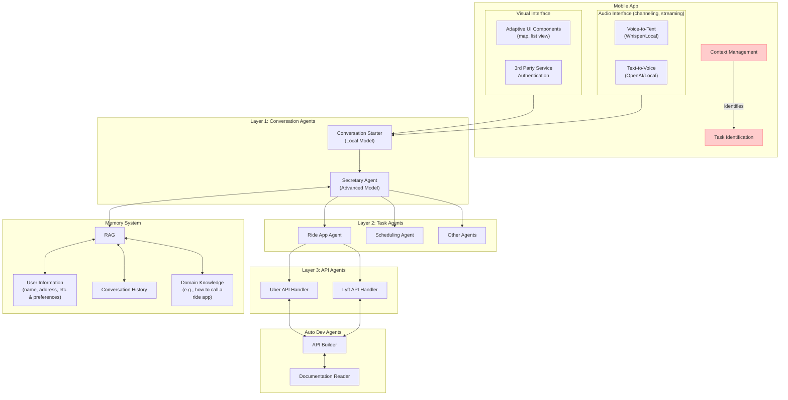

# Project H.E.R. - System Architecture

## Architecture Diagram

## Mobile App

### Interface Components

#### Visual Interface
- **Adaptive UI Components** (map, list view)
- **3rd Party Service Authentication**

#### Audio Interface (channeling, streaming)
- **Voice-to-Text** (Whisper/Local)
- **Text-to-Voice** (OpenAI/Local)

### Context Management
> Once the app identifies the context of the conversation, e.g., "I need to call a Uber now," it can identify the task the user needs to do and if it can do it for the user, it will raise the conversation with a suggestion.

## Agent Architecture

### Layer 1: Conversation Agents
- **Conversation Starter** (Local Model)
- **Secretary Agent** (Advanced Model)

> The secretary agent will invoke a task agent to take on the assigned task. Later on, the API agent will be invoked.

> A task agent is an LLM agent that has been equipped with specific instructions, knowledge, and tools (including API agents).

### Layer 2: Task Agents
- **Ride App Agent**
- **Scheduling Agent**
- **Other Agents**

### Layer 3: API Agents
- **Uber API Handler**
- **Lyft API Handler**

> The API agents will handle the specific API for the task agent.

> The instruction from the task agent (e.g., get a car home) will be translated into API calls for a specific app (e.g., Uber).

### Auto Dev Agents
- **API Builder**
- **Documentation Reader**

> The dev agent will automatically develop API calling functions and wrap them with a basic API agent wrapper (a beta version of the API agent).

> This agent will be triggered when a task requires an API agent that hasn't been deployed.

> Manual coding and testing is needed for a published API agent.

## Memory System

### Components
- **RAG** (Retrieval-Augmented Generation)
- **User Information** (name, address, etc. & preferences)
- **Conversation History**
- **Domain Knowledge** (e.g., how to call a ride app)

## Data Flow

1. User interacts through Visual or Audio Interface
2. Conversation Starter processes initial input
3. Secretary Agent determines context and required actions
4. Appropriate Task Agent is activated based on the request
5. Task Agent uses relevant API Agents to execute the request
6. Memory system provides context throughout the process
7. Response is returned to the user through the appropriate interface

## Development Process Notes

Auto Dev Agents assist with:
- Automatically generating API integration code
- Reading API documentation
- Building new capabilities based on documentation
- Wrapping API calls in appropriate agent interfaces

> The API integration process initially requires significant human oversight, with gradual automation improvements over time.
